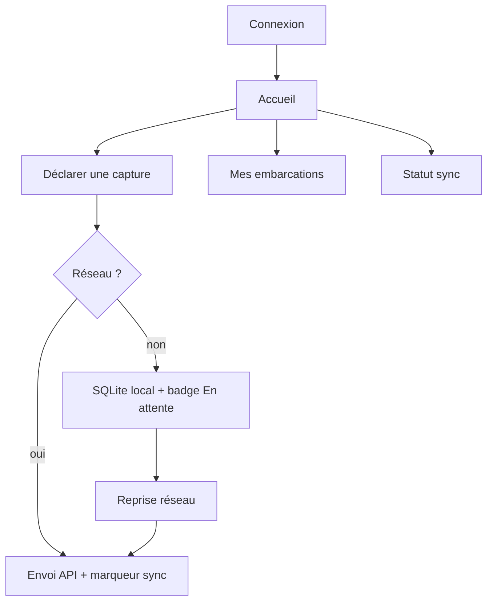

# Maquettes — parcours pêcheur (mobile)

Wireframes basse fidélité — Phase 1. Cible : Android prioritaire (§2.2). Stack mobile : voir ADR-001 (Expo proposé).

## Parcours principal



## Écrans (basse fidélité)

### 1. Connexion
```
┌─────────────────────────┐
│      CBM-PIGAP          │
│                         │
│  Téléphone / e-mail     │
│  [________________]     │
│  Mot de passe           │
│  [________________]     │
│                         │
│  [    Se connecter    ] │
└─────────────────────────┘
```

### 2. Accueil pêcheur
```
┌─────────────────────────┐
│ Sync: ● à jour / ○ …    │
│ Bonjour, {prénom}       │
│                         │
│ [ Déclarer une capture ]│
│ [ Mes embarcations     ]│
│ [ Historique captures  ]│
└─────────────────────────┘
```

### 3. Déclaration de capture (M4)
```
┌─────────────────────────┐
│ Nouvelle capture        │
│ Espèce   [ liste ▼ ]    │
│ Quantité kg [____]      │
│ Méthode  [________]     │
│ Débarquement [____]     │
│ Date/heure   [____]     │
│ GPS: auto si dispo      │
│                         │
│ [ Enregistrer ]         │
│ (fonctionne hors-ligne) │
└─────────────────────────┘
```

### 4. Indicateur sync
- « En attente de synchronisation » (file locale non vide)
- « Synchronisé » (dernier `synchronise_a` OK)

## Hors maquette Phase 1
- Écrans agent / autorité (portail web M6)
- Carte mobile détaillée (M2 peut réutiliser une vue simple plus tard)
