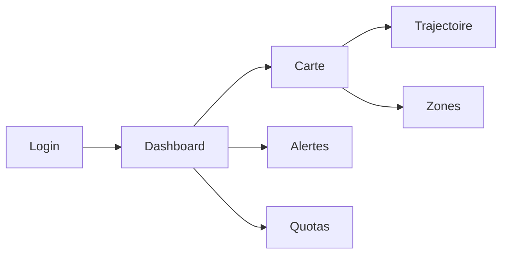

# Maquettes — portail autorités (web)

Wireframes basse fidélité — Phase 1. Cartographie : voir ADR-002 (MapLibre proposé).

## Vue d'ensemble M6



## Écran tableau de bord
```
┌──────────────────────────────────────────────────────────┐
│ CBM-PIGAP  |  Période [du __ / au __]  [Actualiser]     │
├──────────────┬──────────────┬──────────────┬─────────────┤
│ Pêcheurs     │ Volume total │ Alertes      │ Quotas >90% │
│ actifs : N   │ : X kg       │ actives : K  │ : M         │
├──────────────┴──────────────┴──────────────┴─────────────┤
│ Carte MapLibre                                           │
│  · zones réglementées (polygones)                        │
│  · densité d'activité / trajectoires (filtre embarcation)│
├──────────────────────────────────────────────────────────┤
│ Répartition par espèce (barres / tableau)                │
├──────────────────────────────────────────────────────────┤
│ Liste alertes actives (type, gravité, déclencheur abrégé)│
└──────────────────────────────────────────────────────────┘
```

## Écran trajectoire (M2)
```
┌────────────────────────────────────────┐
│ Embarcation [sélection ▼]              │
│ Période [____] → [____]                │
│ Carte : points 1…n dans l'ordre chrono  │
└────────────────────────────────────────┘
```

## Écran zones (M3 — admin)
```
┌────────────────────────────────────────┐
│ Zones réglementées                     │
│ [Importer GeoJSON]  [Nouvelle zone]    │
│ Liste : nom | type | actif | actions   │
└────────────────────────────────────────┘
```

## Critère d'acceptation lié (§5.6)
Les chiffres du dashboard = données injectées en base (pas d'approximation).
