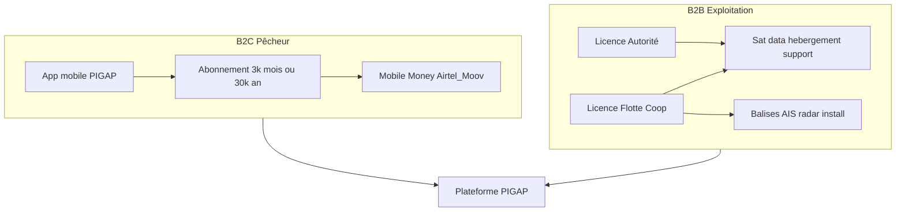

# Modèle économique PIGAP — abonnements & licences B2B

> Document commercial / stratégique (Phase 3–4).  
> **Implémentation code** : module `backend/app/modules/abonnements/` (Mobile Money mode `demo` par défaut).  
> Le cahier §2.2 excluait le paiement du MVP — activé explicitement pour Phase 4 / pilote monétisé.  
> Devise : **FCFA (XAF)**. Hypothèse de change indicative : **1 USD ≈ 600 FCFA** (à recalibrer).

---

## 1. Synthèse

PIGAP monétise deux canaux complémentaires :

| Canal | Client | Rôle économique |
|-------|--------|-----------------|
| **B2C** | Pêcheur (1 embarcation) | Abonnement usage app (déclarations, GPS mobile, dossier). Ne finance **pas** balises / sat / SOC. |
| **B2B Autorité** | Ministère / DPM / marine / parcs | Licence d’exploitation nationale : portail, hébergement, support, AIS open. |
| **B2B Flotte** | Coopérative / armateur | Soft multi-embarcations + option pack matériel (balise + airtime). |

**Règle anti double facturation :** un pêcheur couvert par une licence Flotte B2B **ne paie pas** le B2C (inclus dans le pack) ; un pêcheur indépendant paie le B2C seul.

---

## 2. Architecture commerciale

| Offre | Qui paie | Inclus | Exclu |
|-------|----------|--------|-------|
| **B2C licence usage** | Pêcheur | App, déclarations, GPS mobile, dossier licence, sync offline | Balise physique, radar, feed sat premium |
| **B2B Autorité** | État / DPM / ANPN | Portail web, alertes, cartes, sièges, hébergement, AIS open, support | CAPEX balises (sauf marché équipement séparé) |
| **B2B Flotte** | Coop / armateur | Sièges flotte, suivi multi-embarcations, reporting | Pack matériel + airtime en **add-on** |

---

## 3. B2C — pêcheurs (tarifs retenus)

| Formule | Prix TTC | Équiv. mensuel | Remise |
|---------|----------|----------------|--------|
| Mensuel | **3 000 FCFA** | 3 000 | — |
| Annuel | **30 000 FCFA** | 2 500 | **−17 %** |

### 3.1 Encaissement Mobile Money (Gabon)

- Opérateurs : **Airtel Money**, **Moov Money**.
- Agrégateurs cibles (V2) : SingPay, PViT, E-Billing.
- Frais pay-in typiques : **~2–2,5 %** → net ≈ **2 925 FCFA** (mensuel) / **≈ 29 250 FCFA** (annuel).

### 3.2 Adéquation contexte gabonais

- Flotte artisanale maritime d’ordre **~500–1 000 pirogues** (références 2021–2022).
- Pouvoir d’achat sous pression (carburant, restrictions de zones) → **privilégier l’annuel** (moins de friction Mobile Money, churn plus bas).
- 3 000 FCFA/mois ≈ petit forfait data / quelques litres de fuel — acceptable si l’abonnement est **lié au renouvellement de la licence de pêche**.

### 3.3 Scénarios revenus B2C seuls

| Adoption (formule annuelle) | CA brut / an | Net ≈ (−2,5 %) |
|-----------------------------|--------------|----------------|
| 100 pêcheurs | 3,0 M FCFA | 2,9 M |
| 500 | 15 M | 14,6 M |
| 1 000 | 30 M | 29,3 M |

**Verdict :** le B2C finance l’engagement pêcheur et une part du SaaS léger. **L’infrastructure (balises, sat, hébergement, support) est portée par le B2B.**

---

## 4. Structure de coûts à absorber

Ordres de grandeur pour calibrer les licences B2B :

| Poste | Unité | Fourchette FCFA | Note Gabon |
|-------|-------|-----------------|------------|
| Balise hybride cell+sat (type NEMO / VMS artisanal) | 1 embarcation | **300–450 k** matériel | Programme national CLS NEMO déjà lancé : PIGAP = **couche logicielle** ; matériel en partenariat ou marché séparé |
| Installation + formation terrain | 1 embarcation | **50–150 k** | Libreville / Port-Gentil / Mayumba |
| Airtime cell+sat | 1 embarcation / an | **150–250 k** | Réf. publique ~249–349 USD/an |
| Feed AIS satellitaire premium (Spire / exactEarth / CLS) | pays / an | **5–40 M** | Open AIS ([ADR-005](adr/ADR-005-ais-zee-gabon-open-data.md)) gratuit mais **insuffisant** en ZEE |
| Radar côtier / fusion | site | **Dizaines de M+** | Option Phase 2 commerciale — **hors pack de base** |
| Hébergement prod (API + PostGIS + backups + monitoring) | mois | **0,8–2,5 M** | Préférer région Afrique / CEMAC + PRA |
| Support N1/N2, conformité, sécurité | mois | **1–3 M** | Équipe locale + astreinte alertes |
| Setup agrégateur Mobile Money | one-shot | **0–2 M** | + commission récurrente |

**Règle de couverture :**
- CA B2B annuel → **OPEX plateforme + sat + support**.
- CAPEX balises → (a) marché État, (b) leasing flotte, ou (c) subvention projet (FAO, Banque mondiale, Gabon Bleu).

---

## 5. Grille B2B

### 5.1 Licence Autorité — « Exploitation nationale »

| Formule | Prix | Inclus |
|---------|------|--------|
| **Mensuel** | **2 500 000 FCFA / mois** | Portail autorités (jusqu’à **50 comptes**), modules M1–M7, alertes, carte, quotas, overlay AIS open, hébergement, backups, support N1 5j/7, 1 formation / an |
| **Annuel** | **25 000 000 FCFA / an** | Idem (−17 %, aligné B2C) |

#### Add-ons Autorité

| Add-on | Prix indicatif |
|--------|----------------|
| Feed AIS satellitaire premium ZEE | **+8 000 000 FCFA / an** |
| Module fusion radar / centres de contrôle | **Sur devis** (CAPEX site) |
| Comptes au-delà de 50 | **25 000 FCFA / compte / mois** |
| Marché équipement balises (N embarcations) | CAPEX + airtime **pass-through + 8–12 %** marge intégrateur |

À **25 M FCFA/an**, une autorité unique couvre ~ hébergement + support + une part sat light. Le pack sat premium reste **transparent** (facturé à part).

### 5.2 Licence Flotte / Coopérative — « Exploitation métier »

| Formule | Prix | Périmètre |
|---------|------|-----------|
| **Base mensuelle** | **150 000 FCFA / mois** | Jusqu’à **10 embarcations**, 5 comptes, reporting flotte |
| **Base annuelle** | **1 500 000 FCFA / an** | Idem (−17 %) |
| **Au-delà de 10** | **+12 000 FCFA / embarcation / mois** ou **+120 000 / an** | Soft only (GPS app + back-office) |

#### Pack matériel optionnel (par embarcation)

| Mode | Montant | Contenu |
|------|---------|---------|
| Achat | **450 000 FCFA** one-shot | Balise hybride + pose + 3 mois airtime |
| Location | **45 000 FCFA / mois** (engagement 24 mois) | Matériel + airtime + maintenance |
| Après 24 mois | **25 000 FCFA / mois** | Airtime + maintenance seule |

**Exemple :** coop de 20 pirogues, soft only ≈ `150 000 + 10 × 12 000 = 270 000 FCFA/mois`. Avec location balises ≈ `+ 20 × 45 000 = 900 000` → **~1,17 M FCFA/mois** (cohérent avec le coût terrain).

---

## 6. Unité économique — scénarios année 1

### 6.1 Scénario base (pilote)

Hypothèses : 1 contrat Autorité annuel + 2 coops (15 embarcations soft chacune) + 300 pêcheurs en annuel B2C ; **pas** de sat premium ni leasing balises.

| Source | CA brut / an |
|--------|--------------|
| Autorité | 25,0 M |
| 2 × Flotte (base + 5 extras) | ≈ 2 × (1,5 M + 5 × 0,12 M) ≈ **4,2 M** |
| 300 pêcheurs × 30 k | 9,0 M |
| **Total** | **≈ 38 M FCFA** |

OPEX cible (hébergement + support + ops, sans CAPEX balises massif) : **20–30 M FCFA** → marge brute **positive mais fine**.

### 6.2 Scénarios pessimiste / optimiste

| Scénario | Hypothèses | CA brut / an (ordre) |
|----------|------------|----------------------|
| **Pessimiste** | Autorité mensuel × 6 mois seulement ; 1 coop 10 bateaux ; 80 pêcheurs | ≈ **18–20 M** |
| **Base** | Voir §6.1 | ≈ **38 M** |
| **Optimiste** | Autorité annuel + sat premium ; 5 coops (moy. 20 bateaux soft) ; 700 pêcheurs | ≈ **70–90 M** (+ add-ons matériel) |

Sat premium + parc balises national → **contrat État ou bailleur** en plus du forfait logiciel.

---

## 7. Parcours paiement Mobile Money (cible V2 / Phase 4)

Flux cible (non implémenté — hors MVP) :

1. Pêcheur choisit mensuel / annuel dans l’app.
2. Initiation paiement via agrégateur (push USSD / deep link).
3. Webhook agrégateur → backend : statut `payé` / `échoué` / `expiré`.
4. Activation / renouvellement de l’abonnement lié au compte pêcheur (et idéalement au **n° de licence**).
5. Relance J−7 / J−1 avant échéance (message in-app + SMS si budget).

**Recommandation produit :** lier le B2C au **cycle de renouvellement de licence de pêche** pour maximiser l’adoption et réduire le churn.

---

## 8. Positionnement vs NEMO et AIS open

| Élément | Rôle |
|---------|------|
| **CLS NEMO** (déjà lancé au Gabon) | Balises physiques artisanales — ne pas vendre la balise comme USP exclusive de PIGAP |
| **PIGAP** | Système métier : licences, captures, quotas, alertes, portail autorités ; peut ingérer `source=balise` (schéma déjà prévu) |
| **AIS open (ADR-005)** | Overlay ZEE gratuit / démo — couverture limitée ; feed premium = add-on Autorité |

---

## 9. Recommandations de phase

| Phase | Monétisation |
|-------|----------------|
| **Phase 3 — Expérimentation terrain** | Pilote **gratuit ou subventionné** ; valider usage, zones, espèces ; pas de facturation réelle |
| **Phase 4 — Déploiement** | Activer B2B Autorité en premier (couvre l’OPEX) ; B2C annuel ; Flotte pour coops volontaires |
| **V2** | Intégration Mobile Money, dunning, marché balises / leasing, feed sat premium |

### Points à confirmer localement

- Régime **HT / TTC / TVA** Kimba Connect (expert-comptable).
- Partenariat ou coexistence avec le programme **NEMO / Canopé**.
- Marché public vs contrat de service pour la licence Autorité.

---

## 10. Références internes

- Cahier §2.2 — hors périmètre paiement / IoT balises physiques (MVP).
- [ADR-005 — AIS ZEE open data](adr/ADR-005-ais-zee-gabon-open-data.md).
- Point d’extension schéma : `Position.source = mobile | balise`.
